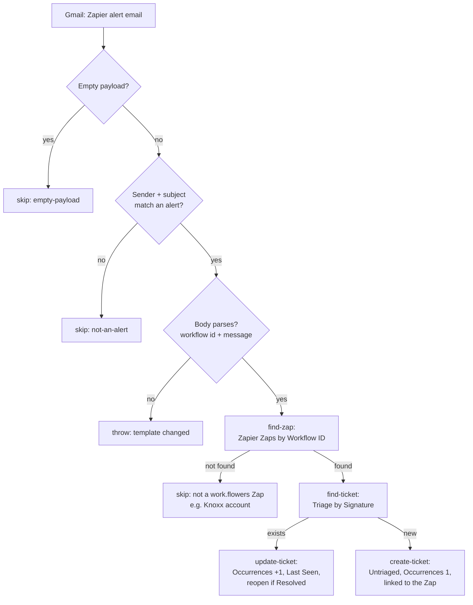

# zapier-error-email-to-triage

Turns Zapier's failure alert emails for work.flowers Code Zaps into tickets in the **Zapier Error Triage** Notion database (`db78a092-515d-40e6-9416-aab114460f86`).

It replaces the `errorsDelta` sync in the notion-workers `zapier-durables-docs` worker, which walked every durable's run history hourly to find failures. That walk existed because durables used to send no failure notification. Zapier now emails the Zap owner on every failed run, about three minutes after it happens, so the walk was paying Notion credits for something an email already tells us.

## Trigger

Gmail **New Email Matching Search** on dennis@work.flowers:

```
from:notifications@mail.zapier.com subject:("had an error" OR "couldn't run")
```

Zapier sends two alert subjects for Code Zaps, and both are ticketed:

| Subject | Meaning | `Error Type` |
|---|---|---|
| `Your Zap "<name>" had an error` | the run failed in our code | `Zap error` |
| `Your Zap "<name>" couldn't run` | a Zapier-side failure (the 2026-09-15 outage, `upstream_rejected`) | `Couldn't run` |

The search only narrows what Gmail polls. `extractAlert()` re-checks the exact sender and subject shape.

## Flow



## What a ticket is

One ticket per **signature**: `<workflow id> · <Error Type> · <normalised message>`. The normalisation is ported from the worker's `normaliseMessage` and strips ids, timestamps, semver and appended JSON dumps, so the same fault recurring lands on one ticket.

- **New signature:** a ticket is created with `Status = Untriaged`, `Occurrences = 1`, `First Seen`/`Last Seen` set to the email's timestamp, and `Zap` linked to the Zaps row.
- **Repeat:** `Occurrences` goes up by one and `Last Seen` moves. A `Resolved` ticket goes back to `Untriaged`. `Won't fix` is a deliberate verdict and stays closed.
- **Hands off:** the page body, `Priority`, `Assignee`, `Root Cause`, `Resolution Notes`, `Resolved on` and `GitHub Pull Requests`. Diagnosis lives in the page body and belongs to whoever triages.

### What the email can't tell us

The alert email carries the Zap name, the workflow id (from the "Open in workflow manager" link) and a readable error message. It does **not** carry a run id, the error type, or the failing step. So, compared with the worker's tickets:

- **`Zap Runs` and `Failing Step` are not written.** Find the run from the Zap's run history around `Last Seen`.
- **Signatures differ from the worker's.** The email's text is Zapier's friendly wording (e.g. *"We couldn't confirm the outcome of your Zap run…"* where the worker saw `upstream_rejected`). A fault the worker ticketed before 2026-10-03 opens a fresh ticket the first time it recurs.

## Knoxx and other accounts

Knoxx-account Zaps alert the same inbox (`batch-so-creation-cron` did during the 2026-09-15 outage). The `find-zap` lookup doubles as the account filter: a workflow id missing from the **Zapier Zaps** table (`261b21a7-…`, synced from the work.flowers account by the worker's `zapsSync`) is skipped and logged.

**Known gap:** `zapsSync` runs daily, so a brand-new work.flowers Zap that fails before its first sync is skipped rather than ticketed. Its alert email is still in the inbox.

## Unrecognised payloads

This repo throws on unrecognised payloads (see `CLAUDE.md`):

- **An empty ping skips.**
- **A non-alert email skips.** The Gmail search is fuzzy, so a non-alert match is expected noise, not a schema change.
- **An email from Zapier's alert sender with an alert subject whose body no longer parses THROWS.** That means Zapier changed the template, and skipping it would silently stop all ticketing.

## Concurrency

Two alerts for the same new signature arriving within seconds of each other can both find no ticket and both create one. The 2026-09-15 outage produced 14 failures of one Zap in 50 minutes, so this is possible, but each is a separate Gmail poll and they are spread out in practice. Duplicates are harmless and can be merged by hand. Repo posture: accept rare duplicates rather than build a lock (see "Concurrency" in the shared rules).

## Prerequisites

- Both Notion data sources must be shared with the **Zapier** integration that backs `notion_wf` (`02b73654-…`). They were created by the worker, so they weren't shared by default. Unshared, the API answers `404 object_not_found`.
- The triage database must stay **detached** from the worker (`ntn workers databases detach errors`, done 2026-10-03). While it was worker-managed, its columns were read-only to everything but the worker's sync.

## Testing

```shell
npm test        # offline: parses the two real alert emails in fixtures/, 8 checks
```

Verified live with `run-durable` on 2026-10-03, against the real `had an error` fixture and the production Notion databases:

| Case | Result |
|---|---|
| New signature | `created`: ZAP-58, `Untriaged`, `Occurrences 1`, `Zap` linked, First/Last Seen = the email's 2026-09-30 04:34Z |
| Same email again | `updated`, `Occurrences 2` |
| Ticket set to `Resolved`, same email again | `updated`, `reopened: true`, back to `Untriaged`, `Occurrences 3` |
| Workflow id not in the Zaps table | `skipped: not-a-work.flowers-zap` |

ZAP-58 was a test ticket and was moved to the Notion trash afterwards.

`fixtures/` holds the real `had an error` (2026-09-30, `slack-thread-to-notion-discussion`) and `couldn't run` (2026-09-30, `gcal-event-updated-to-meeting-note`) emails, reshaped to the Gmail trigger's field names.
