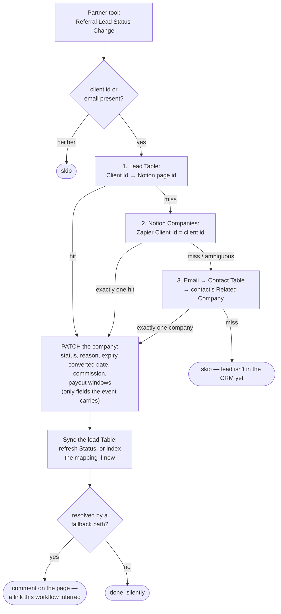

# zapier-partner-lead-status-to-notion

When a **Zapier Solution Partner** referral lead changes status, this writes the lead's current state onto the Notion **Companies** record it belongs to — status, the reason behind it, the 90-day conversion expiry, the converted date, the commission rate, and the Y1/Y2 payout windows.

Migration of the classic Zap **Capture Zapier Lead Status Change**. Its sibling, [`register-zapier-partner-lead`](../register-zapier-partner-lead/), is what submits leads in the first place.

**Status:** ✅ Published and enabled, trigger claimed and active. **Cutover pending** — turn off the classic Zap. See [Cutover](#cutover).

## What it does



## Trigger

`App227952CLIAPI@1.5.0` / `referral_lead_status_change` — a **polling** trigger on the private *Solution Partner Operations Tool* app, authenticated by connection `02a5085e-1d27-853d-89b7-115a57fc4d32` ("work.flowers"). The credential lives on the trigger, not in `--connections`: the workflow code never calls the partner tool.

A poll returns the current state of **every** lead on the account (247 as at 2026-07-28), deduped on `<lead_id>_<lead_status_modified_on>`. Zapier records the first poll after a trigger is claimed as already-seen rather than firing it, so claiming the trigger did not replay the account's lead history — confirmed by `list-workflow-runs` staying empty. Worth re-checking if the workflow is ever disabled and re-enabled.

### Payload

```json
{
  "id": "0060000000004PE00hE_2026-02-09T22:32:19.78",
  "lead_id": "0060000000004PE00hE", "client_id": "0280000000003Rw00hE",
  "name": "…", "first_name": "…", "last_name": "…", "email": "…",
  "status": "Converted", "reason": "Converted to a Paid, Owned Account",
  "expiration_date": "2026-07-22T00:00:00", "converted_date": "2026-01-08T00:00:00",
  "commission_percentage": 0.2,
  "payout_y1_start": "2026-01-08T00:00:00", "payout_y1_end": "2027-01-07T00:00:00",
  "payout_y2_start": "2027-01-08T00:00:00", "payout_y2_end": "2028-01-07T00:00:00",
  "lead_status_modified_on": "…", "created_on": "…",
  "partner_contact": "00500000000005d00hE"
}
```

**The field set varies by status** — `expiration_date` appears on Approved and Expired, `converted_date` and the payout windows only on Converted. That's why the patch only ever writes fields the event actually carries: patching the absent ones to null would wipe a lead's approval expiry the moment it converted. **Nothing here ever clears a Notion value.**

### Statuses

Five, verified against all 247 leads on the account (2026-07-28): **Approved** 209 · **Rejected** 15 · **Converted** 10 · **Expired** 9 · **Submitted** 4.

An unrecognised status is logged and flagged in the run output (`unknownStatus: true`); every other field is still written, and the select is left alone rather than minting a new option by accident.

## Cutover

Turn **off** the classic Zap **Capture Zapier Lead Status Change**. Until then both are subscribed to the same trigger and will both write to Notion. The values agree, so the overlap is benign rather than destructive — but this workflow writes strictly more, and the classic Zap errors out on most leads (see below).

## What changed from the classic Zap

| # | Classic Zap | Here | Why |
| --- | --- | --- | --- |
| 1 | Resolved the company **only** via the lead Table, and treated a miss as an error | Three resolution paths, and a clean skip if all miss | **This is the big one.** 247 leads exist in the partner tool; the Table held 3 real rows and 3 Notion companies carried a client id — because anything submitted straight from the partner portal never passed through the register Zap. The classic Zap therefore did nothing, loudly, for ~99% of leads |
| 2 | Wrote the raw `status` into a select with no matching option | Writes one of five known options | `Converted` and `Expired` had no option to land in. Both were added to the Companies select for this migration; the legacy `Accepted` option is never written — the API has never emitted it |
| 3 | Captured status, client id, lead id | Also reason, expiry, converted date, commission, Y1/Y2 payout windows | The trigger always carried these. Nine leads have already expired unconverted with nothing in the CRM to show it was coming |
| 4 | Never wrote back to the Table | Refreshes `Status`, and indexes the mapping when a fallback path resolved it | The Table's `Status` column was `null` on every row. Backfilling the mapping also means each lead costs a Notion query at most once |
| 5 | Fed the raw `…T00:00:00` timestamps around | Date part only | These name calendar dates, not moments; passing the timeless string as a datetime invites a timezone shift onto it |

## Maintainer notes

- **The Notion write goes through the raw API, not `NotionCLIAPI`** — same reasoning as the sibling workflow: `update_database_item` addresses properties from a cached schema that hadn't picked up the six new `Zapier …` properties, and a raw `PATCH /v1/pages/{id}` can't go stale. Cost is the same; only Zapier Table ops are free.
- **Resolution order is cheapest-and-most-certain first.** The lead Table is free and holds a mapping this system wrote itself. `Zapier Client Id` is exact and survives a lost Table row. The email path is inexact *by nature* — it trusts that the person Zapier calls the account owner is filed under the right company in the CRM — so it's last, requires the contact to resolve to **exactly one** company, and announces itself with a comment on the page.
- **An ambiguous match is never guessed at.** Two companies carrying one client id, or a contact linked to several companies, both fall through rather than picking one.
- **A resolution miss returns rather than throws.** The lead simply isn't in the CRM yet; retrying can't conjure the company, and a later status change will land once someone files the contact. Throwing would spin the durable's retry loop.
- **A Table sync failure is logged, not retried.** By then the Notion record — the thing a human reads — is already correct; a failed Table write only costs the next event a slower lookup.
- **The email path will link a lot of history.** Of 40 unlinked lead emails probed against the contact Table, 33 resolved to a contact. So as statuses change, this workflow will progressively link leads that were never registered through the button. Each one comments on the company page, so those comments are the audit trail for a link nobody explicitly created.
- **`@zapier/zapier-durable` is pinned to 0.10.1, not the latest.** A publish on 0.11.0 failed at run time with `Dependency installation failed` — the runtime's pnpm enforces a minimum release age and 0.11.0 was under a day old. Check the publish date before bumping.

## Notion schema added for this migration

On the **Companies** data source (`21991b07-11ac-80b0-b787-000b3d3995f6`), 2026-07-28:

- `Zapier Lead Status` — added options **Converted** (green) and **Expired** (orange). The three existing `Approved` values were preserved (the DDL merges options by name; option ids for `Submitted`/`Approved`/`Rejected` were unchanged).
- `Zapier Lead Expires` (date) · `Zapier Lead Status Reason` (text) · `Zapier Lead Converted On` (date) · `Zapier Commission %` (number, percent) · `Zapier Payout Year 1` (date range) · `Zapier Payout Year 2` (date range).

Note these date properties are queried in Notion SQL as `date:<name>:start` / `:end`, not by their bare name.

## Verified

Live runs via `trigger-workflow` with **real lead payloads** (the writes are all to Notion and the free Table, so the happy path is safe to exercise):

| Case | Lead | Result |
| --- | --- | --- |
| Path 1 — lead Table | Kim Hing, client `02800000000053P00hE`, Approved | `resolvedVia: "lead-table"`. Wrote `Referral Lead Id`, status, reason, expiry `2026-08-12`, commission `0.2`. Table row `Status` → `Approved` and `Success` → `true` (was `null`/`false` from the classic Zap). No comment, as intended for a routine change |
| Path 3 — contact email | Yipei Huang, client `0280000000005uG00hE`, Approved — a lead never registered through the button | `resolvedVia: "contact-email"`. Resolved through the email Table to her contact, then to company `84486273-…`; **backfilled `Zapier Client Id`** plus all five other fields, indexed the mapping, and commented |
| Path 2 — Notion client id | Same lead, after deleting the row path 3 had just indexed | `resolvedVia: "notion-client-id"`. Found the company by the `Zapier Client Id` path 3 had backfilled, wrote the same six fields, and re-indexed the mapping — so a lost Table row self-heals |
| Types | `tsc --strict` against durable 0.10.1 + sdk 0.91.0 | Clean |
| Trigger claim survives republish | `get-workflow` after re-publishing with `--trigger` | `status: active` |
| No first-poll replay | `list-workflow-runs` after claiming the trigger | Empty — the 247 historical leads did not fire |

## Remaining work

**A `Converted` lead has not been run through.** All three verified runs were `Approved`, so the `converted_date` and Y1/Y2 payout-window branches — the only ones that write a Notion **date range** — are exercised only by the type checker. Ten converted leads exist; running one through `trigger-workflow` would confirm the range write, but it also writes to whatever company that lead resolves to, so it was left as a deliberate first-real-event check. Watch the run output's `written` array for `Zapier Payout Year 1` / `Zapier Payout Year 2`.
